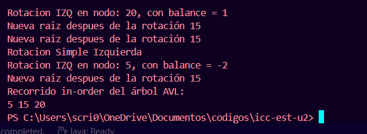

# Práctica 4: Árbol Binario 

- **Título:** Práctica de Pilas y colas
- **Asignatura:** Estructura de Datos  
- **Carrera:** Computación  
- **Estudiante:** Cristopher Salinas  
- **Fecha:** 19/06/2025  
- **Profesor:** Ing. Pablo Torres  

## Descripción

Esta práctica implementa un Árbol Binario de Búsqueda (ABB) con diversas funcionalidades como inserción de nodos, recorridos (InOrden, PreOrden, PosOrden), verificación de balanceo del árbol, cálculo de la altura, el tamaño del árbol, y detección de nodos desequilibrados mediante el factor de equilibrio.

## Estructura del Proyecto

- App.java: Clase principal donde se instancian objetos, se insertan valores en el árbol y se hacen pruebas de las diferentes funcionalidades implementadas.
- BinaryTree.java: Clase que representa el árbol binario de búsqueda con sus métodos de inserción, búsqueda, recorrido y análisis.
- Node.java: Clase modelo que define la estructura de cada nodo del árbol (no mostrada aquí pero se asume como parte del paquete materia.models).

## Funcionalidades Principales

- Inserción de nodos al árbol binario.
- Cálculo de altura del árbol completo y de nodos individuales.
- Cálculo del tamaño total del árbol (cantidad de nodos).
- Verificación del balanceo del árbol.
- Recorridos del árbol:
  - InOrden
  - PreOrden
  - PosOrden
- Impresión de recorridos InOrden con:
  - Altura de cada nodo.
  - Factor de equilibrio (fE) de cada nodo.
- Detección e impresión de nodos desequilibrados, cuyo factor de equilibrio es mayor a ±1.
- Búsqueda de nodos por valor.

## Ejemplo de Ejecución

El programa realiza las siguientes acciones:

1. Inserta los nodos: 50, 17, 76, 9, 23, 54, 14, 19.
2. Imprime el peso (tamaño) y altura del árbol.
3. Realiza el recorrido InOrden.
4. Muestra el recorrido InOrden con alturas.
5. Muestra el recorrido InOrden con factores de equilibrio.
6. Verifica si el árbol está balanceado.
7. Busca un nodo específico.
8. Inserta un nodo adicional si existe una condición.
9. Imprime nuevamente el estado del árbol.

## Notas

- Esta práctica no incluye autobalanceo (como en los árboles AVL), pero permite identificar los nodos desequilibrados para un análisis posterior.
- Se utiliza una pila (`Stack`) para almacenar y mostrar los nodos no balanceados.
.png>)

